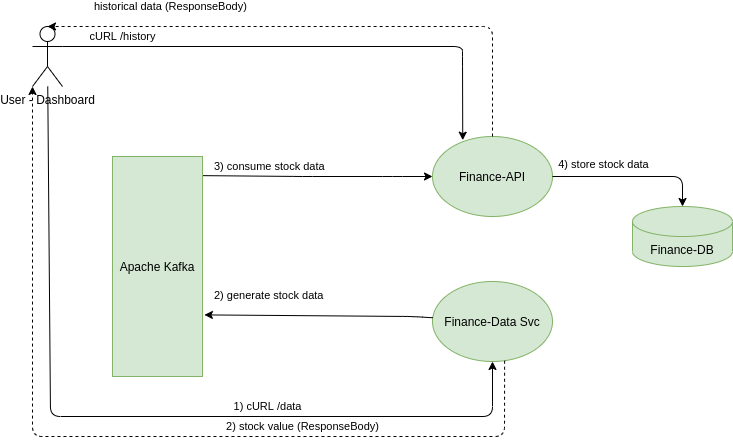

# Finance-Data-Svc

The following service is part of the "Live Finance Demo".
It is a simple Spring REST reactive service that produces a new stock value to kafka and returns it



The other service "Finance-API" consumes this data, stores it in a DB for historical purposes and serves the client requests for latest and historical stock values

## How-To

1. Ensure Kafka is started. Use the docker-compose file "Kafka-dockercompose.yml"
    ````
   docker-compose -f Kafka-dockercompose.yml up
   ````
2. Run the spring boot service
3. curl the endpoint to see the type of values generated/produced into Kafka:
    ````
    curl -i -H "Content-Type: application/json" localhost:8090/data
    ````